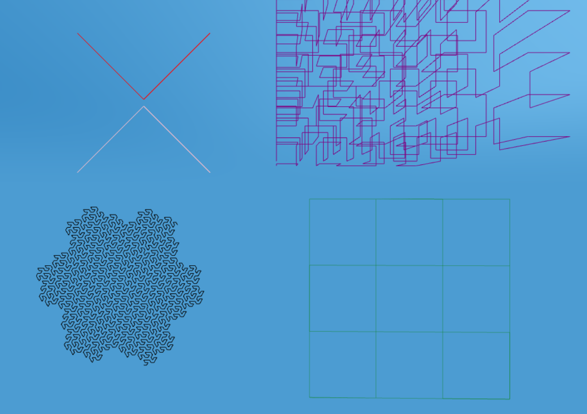

aframe-lines
============

A component and primitive to draw a connected series of lines, for [A-Frame](https://aframe.io) [WebXR](https://immersive-web.github.io//).  Similar to the [line](https://aframe.io/docs/1.0.0/components/line.html) primitive, but draws multiple lines.




[live example scene](https://dougreeder.github.io/aframe-lines/example.html)

It's usually more efficient to do a connected series of line with only one `lines` element, even if you have to draw back over some parts of some lines.
(See example.)


Usage
-----

Include using 
```html
<script src="https://unpkg.com/aframe-lines@^1.0.0/lines.js"></script>
```

```html
<a-lines points="-10 0 0, 0 10 0, 10 0 0" color="blue"></a-lines>

<a-entity lines="points: -10 0 0, 0 10 0, 10 0 0; color:blue"></a-entity>
```

Parameters
----------

### points

Each point is specified by three floating-point coordinates (x, y, z), separated by one or more spaces.  Points are separated by commas. Zero is used for missing coordinates.

A line is drawn from the first point to the second, the second to the third, and so on.  No line is drawn from the last point to the first - if you want that, just repeat the first point as the last.

### color
* default: black

### opacity
* default: 1.0

1.0 is fully opaque.

### visible
* default: true

False means the lines aren't drawn.


Development
---
`npm install`

edit files

`npm test`

All unit tests must pass before a pull request can be accepted.
To the extent possible, code that does not use AFRAME, THREE or the browser should be refactored into pure JavaScript functions, and unit tests written for those functions.
